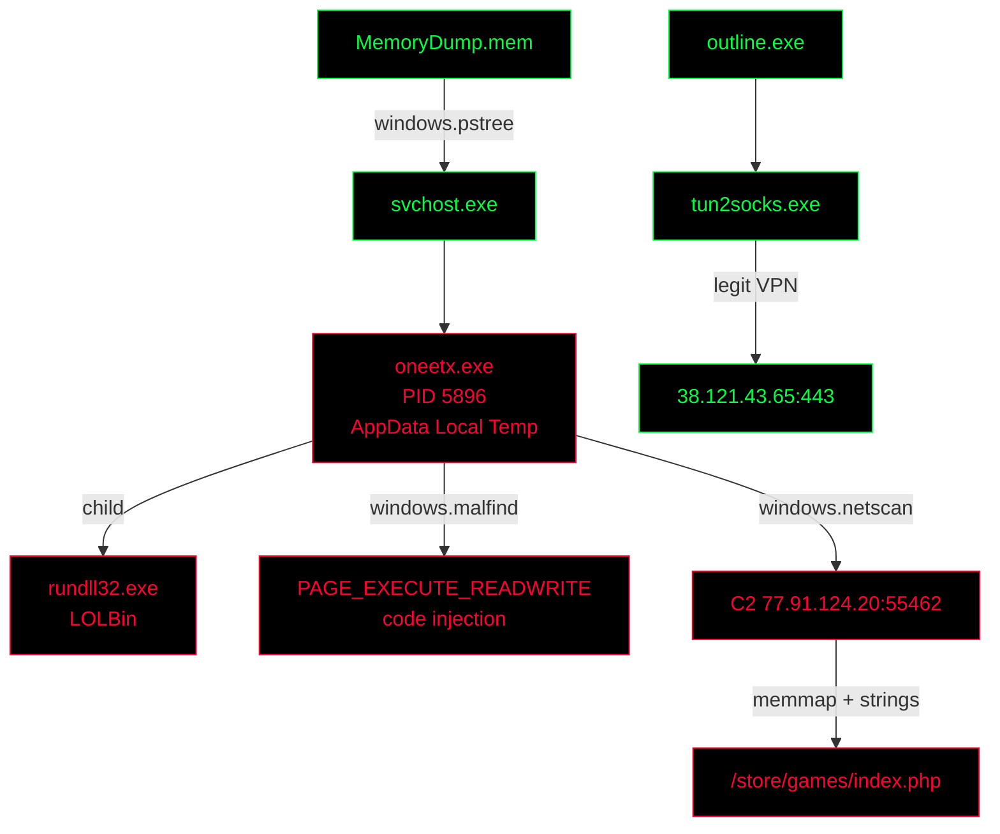

<!-- ═══════════════════════════ HEADER ═══════════════════════════ -->
<div align="center">


<a href="https://cyberdefenders.org/blueteam-ctf-challenges/redline/">

</a>

<br/>


</div>

---

## `> whoami`

```bash
krikox@matrix:~$ cat case_file.txt

[CASE]      RedLine Lab — CyberDefenders Blue Team Lab
[EVIDENCE]  MemoryDump.mem  (Windows RAM capture)
[ALERT]     Host compromised — attacker bypassed defenses and executed payload
[GOAL]      Identify the malicious process and its child, prove code injection,
            separate C2 traffic from VPN traffic, recover the C2 URL and the
            full path of the malicious executable.
[ANALYST]   krikox — Blue Team / DFIR
```

---

## `> man volatility3`

**Volatility 3** is the open-source **memory forensics framework** maintained by the Volatility Foundation, written in Python 3. It analyzes a RAM image *offline*, exposing evidence that never touches the disk: injected code, live sockets, command lines, and strings resident in process memory.

| Plugin | Used for | Question |
|---|---|---|
| `windows.pstree` | Parent → child process hierarchy | Q1 · Q2 · Q4 |
| `windows.malfind` · `windows.vadinfo` | Memory regions + protection flags (RWX) | Q3 |
| `windows.netscan` | TCP/UDP sockets with owner PID + remote IP | Q5 |
| `windows.memmap --dump` | Dumps the full address space of a PID | Q6 |
| `windows.pstree` · `windows.dlllist` · `windows.filescan` | Image path of the process (fallback when `cmdline` is empty) | Q7 |

---

## `> ./install.sh`

```bash
# Kali enforces PEP 668 -> isolated install with pipx
sudo apt update && sudo apt install -y pipx python3-dev build-essential binutils
pipx ensurepath && source ~/.zshrc
pipx install volatility3
vol -h                                   # verify
```

> **Note:** official write-ups run `python vol.py ...` from a cloned repo. With pipx, replace it with **`vol`**.

---

## `> ./playbook.sh --pivot-methodology`

```text
┌─[ STEP 1 · PROCESS TREE TRIAGE ]─────────────────────────────────────────────┐
│ Spot the process that does not belong                                        │
│                                                                              │
│ WHO   : windows.pstree                                                       │
│ WHAT  : Odd path (AppData\Local\Temp) + odd parent (svchost)                 │
│ WHEN  : Process create time                                                  │
│ WHY   : Anomalous lineage = first IOC                                        │
│                                                                              │
│ $ vol -f MemoryDump.mem windows.pstree                                       │
│                                                                              │
│ PIVOT: oneetx.exe (PID 5896) -> child rundll32.exe                           │
└──────────────────────────────────────────────────────────────────────────────┘

┌─[ STEP 2 · INJECTION HUNT ]──────────────────────────────────────────────────┐
│ Look for writable + executable memory                                        │
│                                                                              │
│ WHO   : windows.malfind / windows.vadinfo                                    │
│ WHAT  : VAD protection flags of PID 5896                                     │
│ WHEN  : Regions mapped at capture time                                       │
│ WHY   : RWX memory = shellcode / code injection                              │
│                                                                              │
│ $ vol -f MemoryDump.mem windows.malfind --pid 5896                           │
│                                                                              │
│ PIVOT: PAGE_EXECUTE_READWRITE                                                │
└──────────────────────────────────────────────────────────────────────────────┘

┌─[ STEP 3 · NETWORK SEPARATION ]──────────────────────────────────────────────┐
│ Split malicious traffic from legitimate VPN traffic                          │
│                                                                              │
│ WHO   : windows.netscan + windows.pstree                                     │
│ WHAT  : Owner PID + ForeignAddr, then owner's parent                         │
│ WHEN  : Sockets alive or recently closed                                     │
│ WHY   : Not every external IP is the attacker                                │
│                                                                              │
│ $ vol -f MemoryDump.mem windows.netscan | grep -Ei "oneetx|tun2socks"        │
│                                                                              │
│ PIVOT: C2 77.91.124.20 | VPN outline.exe -> tun2socks.exe                    │
└──────────────────────────────────────────────────────────────────────────────┘

┌─[ STEP 4 · MEMORY STRINGS ]──────────────────────────────────────────────────┐
│ Dump process memory and grep for the C2                                      │
│                                                                              │
│ WHO   : windows.memmap --dump + strings                                      │
│ WHAT  : URLs / HTTP requests left in RAM                                     │
│ WHEN  : Artifacts still resident in the process                              │
│ WHY   : Reveals the exact C2 endpoint                                        │
│                                                                              │
│ $ mkdir -p dump-result   # REQUIRED - vol will not create it                 │
│                                                                              │
│ PIVOT: http://77.91.124.20/store/games/index.php                             │
└──────────────────────────────────────────────────────────────────────────────┘

┌─[ STEP 5 · IMAGE PATH ]──────────────────────────────────────────────────────┐
│ Pin the binary on disk for containment                                       │
│                                                                              │
│ WHO   : windows.pstree / dlllist / filescan / cmdline                        │
│ WHAT  : Full path of the malicious executable                                │
│ WHEN  : Launch command line                                                  │
│ WHY   : Needed for eradication + EDR hunting                                 │
│                                                                              │
│ $ vol -f MemoryDump.mem windows.pstree | grep -i oneetx                      │
│                                                                              │
│ PIVOT: C:\Users\Tammam\AppData\Local\Temp\c3912af058\oneetx.exe              │
└──────────────────────────────────────────────────────────────────────────────┘
```

---

## `> ./run_investigation.sh`

### 🔧 Step 0 — Prepare the workspace

```bash
krikox@matrix:~$ cd ~/RedLine/              # folder containing MemoryDump.mem
krikox@matrix:~$ pwd                        # confirm location
krikox@matrix:~$ mkdir -p dump-result       # output dir for dumps (vol will NOT create it)
krikox@matrix:~$ vol -f MemoryDump.mem windows.info
```

<details>
<summary><b>🟢 Q1 — What is the name of the suspicious process?</b></summary>

```bash
$ vol -f MemoryDump.mem windows.pstree
[i] Red flag 1: image path  -> AppData\Local\Temp
[i] Red flag 2: parent      -> svchost.exe spawning a user-path binary
[i] Red flag 3: name        -> unknown / not a Windows binary
[+] ANSWER: oneetx.exe   (PID 5896)
```
</details>

<details>
<summary><b>🟢 Q2 — What is the child process name of the suspicious process?</b></summary>

```bash
$ vol -f MemoryDump.mem windows.pstree | grep -A2 -i oneetx
[i] rundll32.exe = LOLBin, abused to load malicious DLLs under a trusted name
[+] ANSWER: rundll32.exe
```
</details>

<details>
<summary><b>🟢 Q3 — What is the memory protection applied to the suspicious process memory region?</b></summary>

```bash
$ vol -f MemoryDump.mem windows.malfind --pid 5896     # fast: only suspicious regions
$ vol -f MemoryDump.mem windows.vadinfo --pid 5896     # full VAD listing (official write-up)
[+] ANSWER: PAGE_EXECUTE_READWRITE
```

| Protection | Forensic reading |
|---|---|
| `PAGE_EXECUTE_READWRITE` | 🚩 Write + execute → shellcode / code injection |
| `PAGE_EXECUTE_WRITECOPY` | Usually benign — copy-on-write for DLL sections |
</details>

<details>
<summary><b>🟢 Q4 — What is the name of the process responsible for the VPN connection?</b></summary>

```bash
$ vol -f MemoryDump.mem windows.pstree | grep -i -B1 tun2socks
$ vol -f MemoryDump.mem windows.netscan | grep -i tun2socks
[!] Trap: tun2socks.exe owns the socket, but it is only a helper utility
[i] Its PARENT orchestrates the tunnel -> Outline VPN client
[+] ANSWER: outline.exe
```
</details>

<details>
<summary><b>🟢 Q5 — What is the attacker's IP address?</b></summary>

```bash
$ vol -f MemoryDump.mem windows.netscan | grep -Ei "Offset|oneetx|tun2socks|rundll32"
$ vol -f MemoryDump.mem windows.netscan | grep -w 5896          # filter by PID (more precise)
```

| Remote IP | Port | Owner | Verdict |
|---|---|---|---|
| `77.91.124.20` | 55462 | `oneetx.exe` | 🚩 Malware C2 |
| `38.121.43.65` | 443 | `tun2socks.exe` | ✅ Legit VPN tunnel (`outline.exe`) |

```bash
[!] In a real case, review the FULL netscan output before filtering — don't grep only what you already know
[+] ANSWER: 77.91.124.20
```
</details>

<details>
<summary><b>🟢 Q6 — What is the full URL of the PHP file that the attacker visited?</b></summary>

```bash
$ mkdir -p dump-result                                            # REQUIRED
$ vol -f MemoryDump.mem -o dump-result windows.memmap --pid 5896 --dump
$ ls -lh dump-result/                                             # confirm file name
$ strings dump-result/pid.5896.dmp | grep "77.91.124.20"
$ strings -el dump-result/pid.5896.dmp | grep "77.91.124.20"      # UTF-16 strings
[i] Here memmap is correct: we hunt strings in process memory, not the file hash
[+] ANSWER: http://77.91.124.20/store/games/index.php
```

#### 🛠️ FIX — `output directory specified does not exist` / `No such file`

| Symptom | Cause | Fix |
|---|---|---|
| `The output directory specified does not exist: dump-result` | Volatility does not create `-o` directories | `mkdir -p dump-result` in the **same** folder where you run `vol` |
| `strings: 'dump-result/pid.5896.dmp': No such file` | Consequence of the error above — the dump was never written | Create the folder, re-run `memmap`, then `ls dump-result/` |
| Dump empty / tiny | Wrong PID | `vol -f MemoryDump.mem windows.pslist \| grep -i oneetx` |
| `strings` finds nothing | URL stored as UTF-16 | `strings -el ...` |

```bash
# Bullet-proof version: absolute paths, independent of current directory
mkdir -p ~/RedLine/dump-result
vol -f ~/RedLine/MemoryDump.mem -o ~/RedLine/dump-result windows.memmap --pid 5896 --dump
strings ~/RedLine/dump-result/pid.5896.dmp | grep "77.91.124.20"
```
</details>

<details>
<summary><b>🟢 Q7 — What is the full path of the malicious executable?</b></summary>

```bash
# Option 1 — pstree Path column (official write-up method)
$ vol -f MemoryDump.mem windows.pstree | grep -i oneetx

# Option 2 — dlllist: first module of a process = its own .exe
$ vol -f MemoryDump.mem windows.dlllist --pid 5896 | grep -i oneetx

# Option 3 — filescan: file objects cached in RAM
$ vol -f MemoryDump.mem windows.filescan | grep -i oneetx

# Option 4 — cmdline (may return empty, see fix below)
$ vol -f MemoryDump.mem windows.cmdline --pid 5896

[i] Temp folder + random subdir (c3912af058) = classic dropper staging location
[+] ANSWER: C:\Users\Tammam\AppData\Local\Temp\c3912af058\oneetx.exe
```

#### 🛠️ FIX — `windows.cmdline` returns nothing

| Symptom | Cause | Fix |
|---|---|---|
| Empty output / `Required memory at 0x... is not valid` | The process PEB (where the command line lives) was paged out or not captured | Read the path from `pstree` (Path column) or `dlllist` |
| `pstree` shows no Path column | Output too wide, columns cut in terminal | `vol -r csv -f MemoryDump.mem windows.pstree \| grep -i oneetx` |
| `filescan` returns `\Users\...` without `C:` | filescan shows device-relative paths | Prepend the drive letter: `C:\Users\...` |
</details>

---

## `> cat answers.txt`

| # | Question | Answer |
|---|---|---|
| Q1 | Suspicious process | `oneetx.exe` |
| Q2 | Child process | `rundll32.exe` |
| Q3 | Memory protection | `PAGE_EXECUTE_READWRITE` |
| Q4 | VPN process | `outline.exe` |
| Q5 | Attacker IP | `77.91.124.20` |
| Q6 | PHP URL | `http://77.91.124.20/store/games/index.php` |
| Q7 | Executable path | `C:\Users\Tammam\AppData\Local\Temp\c3912af058\oneetx.exe` |

---

## `> cat attack_chain.mmd`



---

## `> diff ramnit.txt redline.txt`

| | Ramnit | RedLine |
|---|---|---|
| Entry point | `netstat` (network) | `pstree` (process tree) |
| Dump plugin | `dumpfiles` → hash the executable | `memmap` → grep strings in memory |
| Key technique | User-executed dropper | Code injection (RWX) + LOLBin (`rundll32`) |

---

## `> cat lessons_learned.txt`

```bash
[1] Start with pstree: wrong path + wrong parent is the fastest IOC.
[2] RWX memory (PAGE_EXECUTE_READWRITE) is the fingerprint of injected code.
[3] Not every external IP is the attacker — trace each socket back to its parent.
[4] Always mkdir the -o output directory before any --dump plugin.
[5] Use strings -el too: Windows stores many strings as UTF-16.
```

---

## `> cat sources.log`

<details>
<summary><b>📚 References</b></summary>

- [RedLine Lab — CyberDefenders](https://cyberdefenders.org/blueteam-ctf-challenges/redline/)
- [RedLine Lab Official Walkthrough — CyberDefenders](https://cyberdefenders.org/walkthroughs/)
- [Volatility 3 — Official Documentation](https://volatility3.readthedocs.io/en/latest/)
- [volatilityfoundation/volatility3 — GitHub](https://github.com/volatilityfoundation/volatility3)
- [volatility3 — Kali Linux Package Tracker](https://pkg.kali.org/pkg/volatility3)

</details>

<!-- ═══════════════════════════ FOOTER ═══════════════════════════ -->
<div align="center">

</div>
